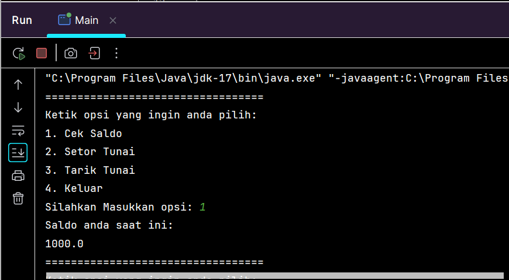
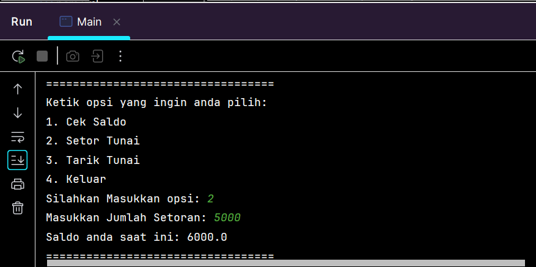
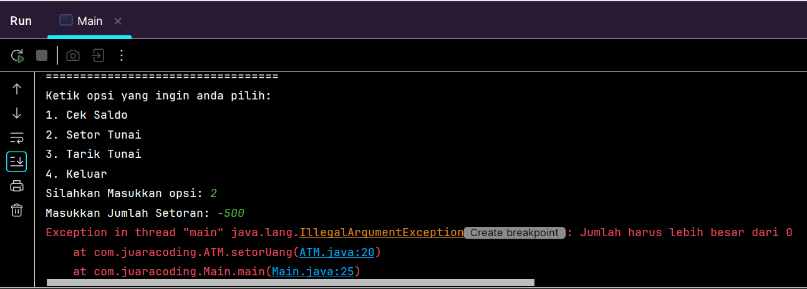
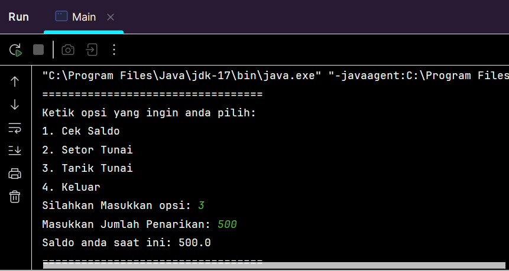
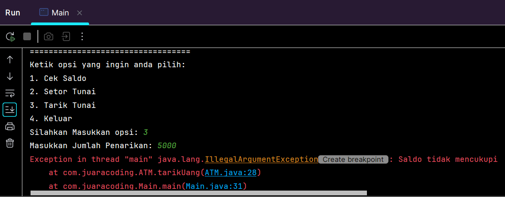
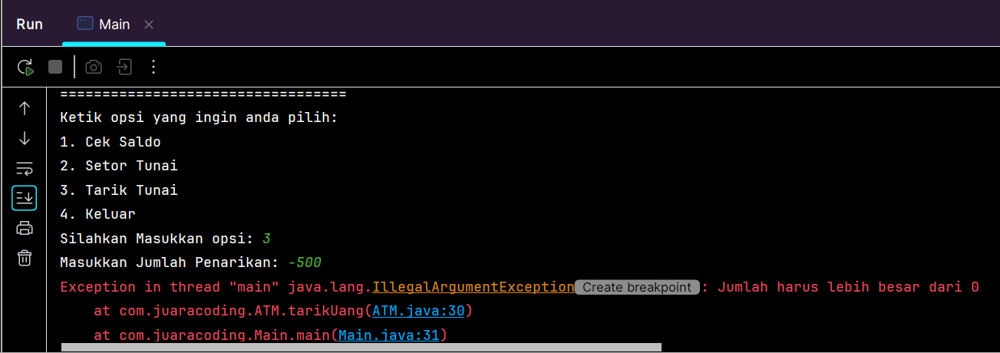
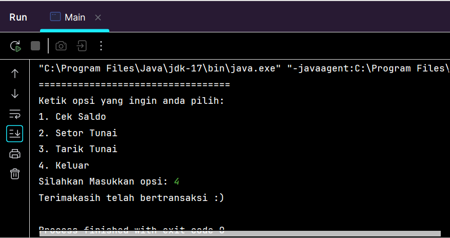
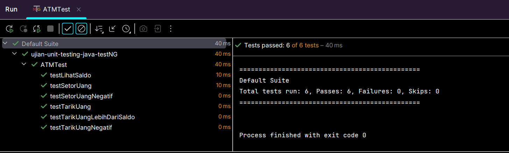

### Implementasi cek saldo awal

### Implementasi setor uang

### Implementasi setor uang negatif

### Implementasi tarik uang

### Implementasi tarik uang lebih dari saldo

### Implementasi tarik uang negatif

### Implementasi opsi keluar

### Hasil unit testing ATMTest yang menguji fungsionalitas dari kelas ATM menggunakan testNG
